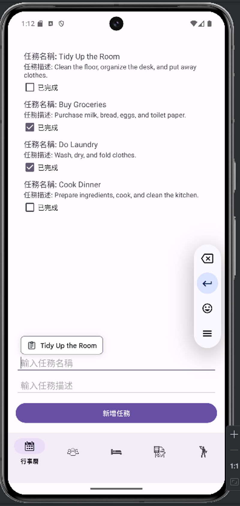
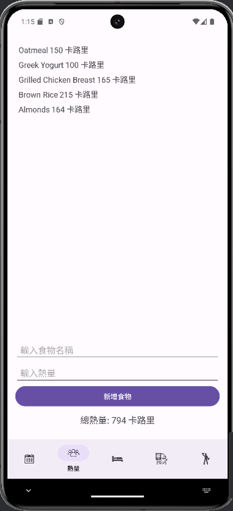
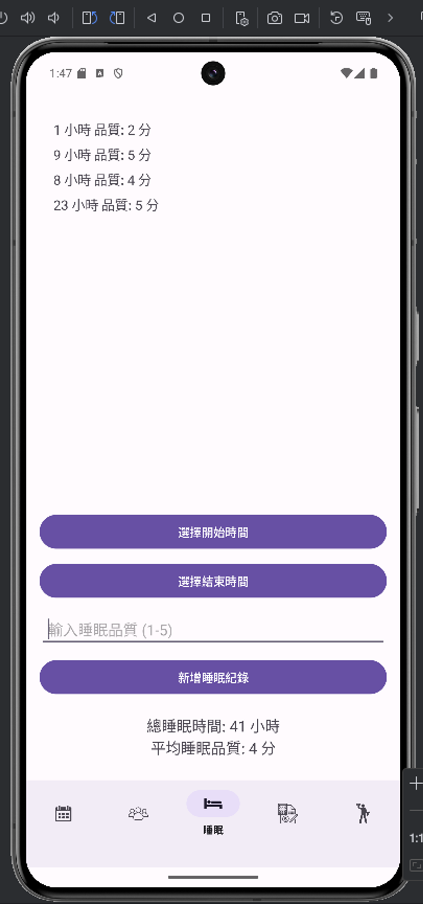
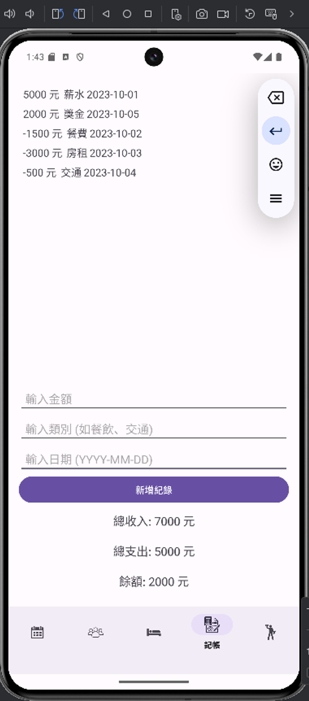
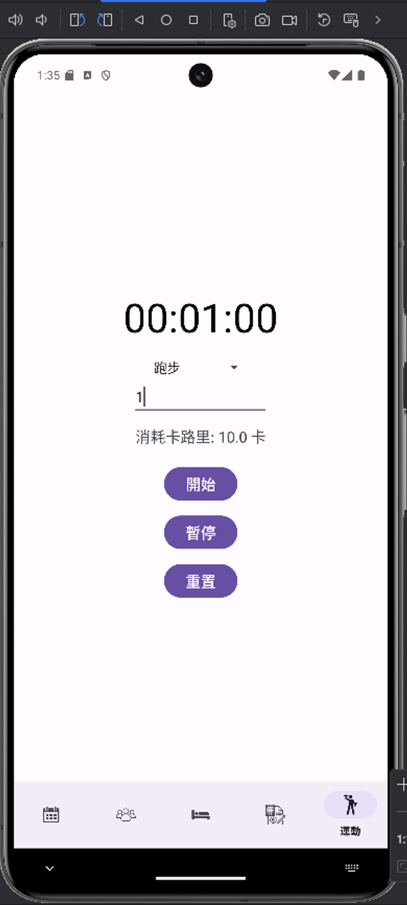

# 生活管家 App

一款實用的 Android 應用，幫助您輕鬆管理日常生活。從行事曆規劃到熱量與運動追蹤，全面提升您的生活效率與健康指數。

---

## 功能介紹

### 1. **行事曆管理**
- **描述：** 隨時新增、編輯、刪除事件，讓您的日程更有條理。
- **特色：**
  - 清晰的日曆視圖，輕鬆查看與管理行程。
  - 提醒功能，讓您不錯過任何重要時刻。
- **模擬器畫面：**
  

### 2. **熱量計算**
- **描述：** 記錄每日飲食，幫助您管理熱量攝取。
- **特色：**
  - 一鍵輸入食物資訊，自動計算熱量。
  - 提供個性化建議，幫助您維持健康飲食習慣。
- **模擬器畫面：**
  

### 3. **睡眠統計**
- **描述：** 追蹤並分析您的睡眠模式，提供睡眠品質報告。
- **特色：**
  - 總睡眠時間與平均品質統計一目了然。
  - 實用的改進建議，助您提升睡眠效果。
- **模擬器畫面：**
  

### 4. **記帳管理**
- **描述：** 簡單記錄收入與支出，讓理財變得更容易。
- **特色：**
  - 詳細報表與圖表視覺化呈現財務狀況。
  - 即時計算總收入、總支出及餘額。
- **模擬器畫面：**
  

### 5. **運動統計**
- **描述：** 設定運動目標，記錄數據，追蹤進步。
- **特色：**
  - 計算每日運動量，提供詳細數據分析。
  - 實現目標的最佳助手。
- **模擬器畫面：**
  

---

## 技術概覽
- **開發語言：** Java
- **開發工具：** Android Studio
- **版本控制：** Git

---

### 操作
1. 開啟 App，選擇需要的功能（如行事曆或記帳）。
2. 按提示輸入相關資料（如行程、食物或睡眠時間）。
3. 查看結果或分析（如日程、熱量攝取或運動進度）。

---

## 專案結構
- 模組化設計，每個功能獨立實現，易於維護與擴展。
- **主要模組：**
  1. 行事曆管理
  2. 熱量計算
  3. 睡眠統計
  4. 記帳管理
  5. 運動統計
